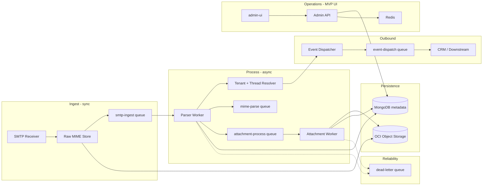
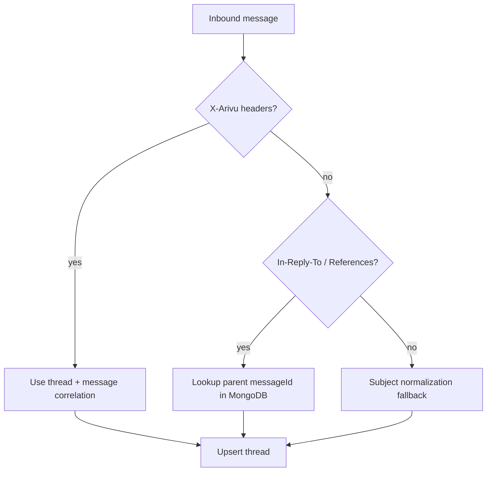

# Arivu Inbound Parser — Implementation Roadmap

This roadmap turns the [detailed requirements](./Arivu%20Inbound%20Parser%20-%20Detailed%20Requir.md) into a phased build plan with milestones, dependencies, and acceptance criteria. It is ordered so each phase delivers a testable slice of the pipeline without blocking later work.

---

## North Star

Build a **provider-agnostic, multi-tenant, queue-driven** inbound email engine where:

1. Raw MIME is stored **before** any parsing (immutable source of truth).
2. SMTP is **fast and thin** (validate → store → enqueue → ACK).
3. All heavy work runs in **horizontally scalable workers**.
4. Downstream CRM systems consume **structured events**, not raw SMTP.
5. Operators can **inspect, debug, and recover** the pipeline via a minimal admin UI (no CRM features).

---

## Architecture (Target State)



---

## Phase Overview

| Phase | Focus | Outcome |
|-------|--------|---------|
| **0** | Foundation | Monorepo, shared packages, local dev, CI basics |
| **1** | Ingest + parse core | SMTP → raw store → queue → MIME parse → tenant routing |
| **2** | Rich email model | Attachments, threading, events to CRM |
| **2U** | Minimal MVP UI | Operator console: Dashboard, Messages, Failures, Queues, Mailboxes, Logs |
| **3** | Production hardening | Retries, DLQ, observability, scale patterns |
| **4** | Security & platform (future) | SPF/DKIM/DMARC, AV, rate limits, multi-node SMTP |

Estimated calendar (single team, ~2 engineers): **Phase 0–1: 3–4 weeks**, **Phase 2: 2–3 weeks**, **Phase 2U: 1–2 weeks** (parallel with late Phase 2 / early Phase 3), **Phase 3: 2–3 weeks**, **Phase 4: ongoing**.

---

## Phase 0 — Project Foundation

**Goal:** Runnable monorepo with shared abstractions so ingest and workers do not duplicate logic.

### Milestones

| # | Milestone | Deliverables | Done when |
|---|-----------|--------------|-----------|
| 0.1 | Monorepo scaffold | `apps/` + `packages/` layout per requirements; pnpm/npm workspaces; TypeScript project references | `pnpm build` succeeds across packages |
| 0.2 | Shared packages (skeleton) | `packages/types`, `config`, `logger`, `database`, `storage`, `events` with interfaces only | Apps import shared types without circular deps |
| 0.3 | Configuration | Zod-validated env (`MONGODB_URI`, `REDIS_URL`, OCI credentials, SMTP bind, limits) | Invalid env fails fast at startup |
| 0.4 | Logging | Pino structured logs with `tenantId`, `messageId`, `correlationId` fields | Log format documented |
| 0.5 | Local infrastructure | Docker Compose: MongoDB, Redis, MinIO (OCI-compatible dev), optional MailHog | `docker compose up` + smoke script |
| 0.6 | Quality gates | ESLint, Prettier, Husky or CI lint; basic GitHub Actions workflow | PR checks pass on empty scaffold |

### Suggested `packages/` contracts (implement early)

- **`types`**: `InternalMessage`, `RoutingAddress`, `ProcessingStatus`, event payloads.
- **`config`**: Central limits (max attachment size, max SMTP message size, stream chunk size).
- **`storage`**: `putRawMime`, `getRawMime`, `putAttachment` — OCI implementation + local MinIO adapter.
- **`database`**: Repository interfaces for `tenants`, `mailboxes`, `messages`, `threads`, `attachments`.
- **`events`**: `EmailReceivedEvent` schema + publisher interface (HTTP/webhook/queue TBD in Phase 2).

### Dependencies

None — start here.

---

## Phase 1 — Core Ingest & Parse Pipeline

**Goal:** End-to-end path: SMTP accepts mail → raw `.eml` on object storage → job enqueued → worker parses MIME → message row in MongoDB with tenant/mailbox resolved.

Aligns with requirements **Phase 1 — Core Infrastructure**.

### Milestones

| # | Milestone | Deliverables | Done when |
|---|-----------|--------------|-----------|
| 1.1 | MongoDB schema + indexes | Collections: `tenants`, `mailboxes`, `messages`; indexes on `tenantId`, `mailboxId`, `messageId`, `receivedAt` | Seed script creates sample tenant/mailbox |
| 1.2 | Routing engine | Plus-address parser: `support+t_123_m_45@reply.arivusystems.com` → `{ tenantId, mailboxId }`; recipient validation against `mailboxes.routingAddress` | Unit tests for valid/invalid/malformed addresses |
| 1.3 | Raw MIME storage | Path pattern `/raw/{tenantId}/{messageId}.eml`; streaming upload (no full-body RAM); immutability (no overwrite) | Integration test: store + read + replay job |
| 1.4 | SMTP receiver (`apps/smtp-server`) | `smtp-server`: STARTTLS, multi-recipient, stream to storage, internal ID (`msg_*`), enqueue `smtp-ingest`, SMTP 250 on success | MailHog/manual client sends 1 MB+ message without OOM |
| 1.5 | Queue wiring | BullMQ: `smtp-ingest`, `mime-parse`; job payload: `{ messageId, tenantId, mailboxId, rawMimePath }` | Job visible in Redis; worker consumes |
| 1.6 | Parser worker (`apps/parser-worker`) | `mailparser`: headers, subject, from/to/cc/bcc/replyTo, text/html, nested multipart; persist to `messages`; `processingStatus` lifecycle | Parsed document matches golden fixture emails |
| 1.7 | Minimal API (`apps/api`) | Health, optional admin: replay parse from `rawMimePath`, get message by id | Operators can re-trigger parse without SMTP |

### Internal message lifecycle (Phase 1)

```text
received → raw_stored → queued → parsing → processed | failed
```

Store `rawMimePath` and external `messageId` (RFC Message-ID header) on every record.

### Acceptance criteria (Phase 1 exit)

- [ ] Forwarded Gmail/Outlook-style MIME (multipart) parses correctly in worker.
- [ ] Unknown recipient → SMTP 550 (or policy-defined rejection), nothing stored.
- [ ] SMTP restart mid-stream does not corrupt partial objects (or marks failed ingest).
- [ ] Parser crash after raw store → message retrievable; raw MIME replayable.
- [ ] Two tenants cannot read each other's messages (query always scoped by `tenantId`).

### Risks & mitigations

| Risk | Mitigation |
|------|------------|
| Memory spikes on large mail | Stream SMTP → storage; stream parse where mailparser allows |
| Routing spoofing via forged plus-tags | Validate extracted IDs against `mailboxes` collection, not address alone |

---

## Phase 2 — Attachments, Threading & Events

**Goal:** Complete CRM-ready message model: files in object storage, conversation grouping, downstream notifications.

Aligns with requirements **Phase 2 — Attachments + Threading**.

### Milestones

| # | Milestone | Deliverables | Done when |
|---|-----------|--------------|-----------|
| 2.1 | Attachment worker (`apps/attachment-worker`) | Queue `attachment-process`; extract filename, mime, size, disposition, content-id; path `/attachments/{tenantId}/{attachmentId}` | PDF + inline PNG from sample email stored and linked |
| 2.2 | Inline images | `multipart/related` + `cid:` references; metadata on `attachments` collection | HTML body references resolvable storage paths |
| 2.3 | Thread resolver | Priority: (1) `X-Arivu-*` headers, (2) `In-Reply-To`, (3) `References`, (4) subject fallback (last resort); `threads` collection upsert | Reply chains same `threadId`; new conversation creates thread |
| 2.4 | Outbound correlation (read path) | Parse `X-Arivu-Tenant`, `X-Arivu-Mailbox`, `X-Arivu-Thread`, `X-Arivu-Message` when present | Reply to Arivu-sent mail links without subject matching |
| 2.5 | Event dispatcher | Queue `event-dispatch`; payload e.g. `email.received` with `tenantId`, `mailboxId`, `messageId` | CRM stub receives event; idempotent publish |
| 2.6 | API expansion | List messages by mailbox/thread; attachment download URLs (signed or internal) | CRM integration doc draft complete |

### Thread resolution flow



### Acceptance criteria (Phase 2 exit)

- [ ] Email with 5 attachments + 2 inline images: all metadata in MongoDB, binaries in OCI only.
- [ ] Reply to prior inbound: same `threadId` via `In-Reply-To`.
- [ ] `email.received` emitted exactly once per successful process (or documented at-least-once + idempotency key).
- [ ] Large attachment (e.g. 25 MB) within configured limit completes without blocking SMTP.

---

## Phase 2U — Minimal MVP UI (Operator Console)

**Goal:** A thin, internal-only admin UI so operators can see ingest health, inspect messages, debug failures, and manage mailboxes—without building CRM features.

**App:** `apps/admin-ui` (React + TypeScript; Vite or Next.js) talking to `apps/api` admin routes.

**Scope:** Read-heavy + safe actions (replay, requeue). No end-customer login, billing, or CRM workflows in MVP.

### Pages (MVP only)

| Page | Purpose | Primary data sources | MVP capabilities |
|------|---------|----------------------|------------------|
| **Dashboard** | At-a-glance pipeline health | MongoDB aggregates, BullMQ stats, recent errors | Ingest count (24h), queue depths, failed count, last processed message, service status chips |
| **Messages** | Browse and inspect parsed mail | `messages` collection, OCI raw path | Paginated list; filters: tenant, mailbox, status, date; detail: headers, bodies, attachments, `rawMimePath`, thread link; actions: replay parse |
| **Failures** | Debug failed / stuck processing | `messages` where `processingStatus=failed`, DLQ jobs | List with error reason, attempt count, link to message + raw MIME; actions: retry, move to DLQ inspect (Phase 3) |
| **Queues** | Monitor async pipeline | Redis / BullMQ (`smtp-ingest`, `mime-parse`, `attachment-process`, `event-dispatch`, `dead-letter`) | Per-queue: waiting, active, completed, failed, delayed counts; recent job sample; optional pause/resume (Phase 3+) |
| **Mailboxes** | Routing configuration visibility | `tenants`, `mailboxes` | List mailboxes per tenant; show `routingAddress`, type (shared/private); read-only in MVP—create/edit via seed/API later |
| **Logs** | Correlate SMTP / parse / queue issues | Pino logs (file tail or log API) | Filter by level, `tenantId`, `messageId`, service; tail recent lines; link from Failures → Logs with correlation id |

### UI information architecture

```text
/admin
 ├── /                    → Dashboard
 ├── /messages            → Messages list
 ├── /messages/:id        → Message detail
 ├── /failures            → Failures list
 ├── /queues              → Queues overview
 ├── /mailboxes           → Mailboxes list
 └── /logs                → Log viewer
```

### Milestones

| # | Milestone | Deliverables | Done when |
|---|-----------|--------------|-----------|
| 2U.1 | Admin API routes | Extend `apps/api`: stats, messages CRUD-read, mailboxes list, queue metrics, log query | OpenAPI or typed client consumed by UI |
| 2U.2 | App shell + nav | `apps/admin-ui`: layout, sidebar (6 pages), env-based API base URL | All routes render; 404 handled |
| 2U.3 | Dashboard page | Summary cards + simple charts (optional) | Refreshes queue + message counts without full reload |
| 2U.4 | Messages page | Table + detail drawer/page | Operator opens inbound email and sees parsed fields + link to raw |
| 2U.5 | Mailboxes page | Tenant/mailbox table with routing address copy | Routing address visible for forwarding setup |
| 2U.6 | Queues page | BullMQ queue stats via API | All five queues visible; stale data < 30s |
| 2U.7 | Failures page | Failed messages + DLQ entries (after 3.2) | Retry/replay triggers API; status updates in UI |
| 2U.8 | Logs page | Log tail/search endpoint + UI filters | Search by `messageId` returns related SMTP/parse lines |

### API dependencies (build with UI)

| UI page | API endpoints (suggested) | Ready after |
|---------|---------------------------|-------------|
| Dashboard | `GET /admin/stats` | Phase 1.7 + queue metrics (1.5) |
| Messages | `GET /admin/messages`, `GET /admin/messages/:id`, `POST /admin/messages/:id/replay` | Phase 1.7 |
| Mailboxes | `GET /admin/mailboxes`, `GET /admin/tenants` | Phase 1.1 |
| Queues | `GET /admin/queues` | Phase 1.5 |
| Failures | `GET /admin/failures`, `POST /admin/failures/:id/retry` | Phase 1.6; DLQ detail Phase 3.2 |
| Logs | `GET /admin/logs?correlationId=&level=&limit=` | Phase 0.4 (+ log shipper or file reader in API) |

### Tech stack (UI)

| Layer | Recommendation |
|-------|----------------|
| Framework | React 18+ with TypeScript |
| Build | Vite (fast local dev) or Next.js if SSR preferred later |
| Styling | Tailwind CSS or minimal component library (shadcn/ui) |
| Data fetching | TanStack Query |
| Tables | TanStack Table or simple HTML tables for MVP |
| Auth (MVP) | None or HTTP basic / API key behind reverse proxy |

### Acceptance criteria (Phase 2U exit)

- [ ] All six pages reachable from nav; no broken routes.
- [ ] Dashboard reflects live queue depth and message counts from dev stack.
- [ ] Messages list shows emails ingested via SMTP test; detail shows subject, from, bodies, status.
- [ ] Failures page lists a deliberately broken parse; replay succeeds from UI.
- [ ] Queues page shows jobs moving through `smtp-ingest` → `mime-parse` during test send.
- [ ] Mailboxes page displays seed tenant mailbox and full routing address.
- [ ] Logs page finds lines for a known `messageId` after test ingest.
- [ ] UI is tenant-aware in display (tenant filter); no cross-tenant data leak in API.

### Out of scope (MVP UI)

- CRM contact/deal views, compose/send mail, user management
- Multi-tenant customer self-service portal
- Real-time websockets (polling every 10–30s is fine for MVP)
- Advanced analytics, alerting rules, RBAC beyond a single admin gate

### Suggested folder addition

```text
apps/
 ├── smtp-server
 ├── parser-worker
 ├── attachment-worker
 ├── api
 └── admin-ui          ← Phase 2U
```

---

## Phase 3 — Reliability, Scale & Observability

**Goal:** Safe operations at SaaS scale: retries, DLQ, metrics, horizontal workers.

Aligns with requirements **Phase 3 — Reliability + Scaling**.

### Milestones

| # | Milestone | Deliverables | Done when |
|---|-----------|--------------|-----------|
| 3.1 | Retry policy | BullMQ attempts with backoff on `mime-parse`, `attachment-process`, `event-dispatch` | Transient OCI/Mongo blips recover without manual fix |
| 3.2 | Dead-letter queue | `dead-letter` queue; poison messages inspectable; manual requeue API | Failed parse after N attempts lands in DLQ with raw path preserved |
| 3.3 | Replay tooling | Admin: re-enqueue from `rawMimePath` by `messageId` | Replay produces new parse version or overwrites per policy |
| 3.4 | Idempotency | Dedupe on external `messageId` + `mailboxId` (or internal id) | Duplicate SMTP delivery does not duplicate CRM events |
| 3.5 | Horizontal scale | Stateless SMTP + N parser workers + N attachment workers; Redis cluster-ready config | Load test: 50 concurrent SMTP sessions, queue depth stable |
| 3.6 | Observability v1 | Metrics: ingest rate, parse latency, queue depth, DLQ count, error rate; structured correlation IDs | Metrics feed **admin UI Dashboard** + optional Prometheus |
| 3.7 | Tracing (optional) | OpenTelemetry hooks on SMTP → queue → worker | Trace spans visible in dev |

### Failure handling matrix

| Failure | Raw MIME | User impact | Recovery |
|---------|----------|-------------|----------|
| SMTP storage fail | Not stored | Sender bounce / retry | Provider resends |
| Enqueue fail | Stored | Delayed processing | Alert + manual enqueue |
| Parse fail | Stored | Message `failed` | Retry → DLQ → replay |
| Attachment fail | Stored, partial parse | Message sans attachments | Retry attachment job only |
| Event dispatch fail | Stored, parsed | CRM lag | Retry event job |

### Acceptance criteria (Phase 3 exit)

- [ ] Zero data loss on parser worker kill mid-job (raw always present).
- [ ] DLQ replay restores message to `processed`.
- [ ] Scale parser workers 1 → 3 without code change.
- [ ] Runbook: top 5 failure modes documented.

---

## Phase 4 — Security & Platform Extensions (Future)

Not required for MVP; track as backlog aligned with requirements **Future Security Extensions** and **Future SMTP Extensions**.

| Item | Priority | Notes |
|------|----------|-------|
| SPF / DKIM / DMARC | High for production mail | May affect accept/reject at SMTP edge |
| Rate limiting + IP reputation | High | Per-tenant and global |
| Antivirus / MIME deep inspection | Medium | Scan after store, before CRM event |
| SMTPS, greylisting | Medium | Infra-dependent |
| DKIM signing (outbound relay) | Low | If parser also relays |

---

## Cross-Cutting Workstreams

Run these in parallel with phases above where possible.

### Testing strategy

| Layer | Approach |
|-------|----------|
| Unit | Routing parser, thread resolver, header extractors |
| Integration | Mongo + Redis + MinIO via Compose; golden `.eml` fixtures (Gmail, Outlook, nested multipart) |
| E2E | SMTP inject → assert MongoDB + OCI + event mock |
| Load | k6 or custom SMTP generator for concurrent connections |

### Fixture library (build in Phase 1)

- Plain text only
- HTML + text alternative
- Nested multipart/mixed
- Inline image + HTML
- Malformed MIME (boundary errors) — expect graceful `failed`, not crash
- Missing `Message-ID`
- Huge attachment (limit boundary)

### Deployment topology (target)

```text
                    ┌─────────────────┐
  Internet ────────►│  SMTP (LB)      │
                    └────────┬────────┘
                             │
         ┌───────────────────┼───────────────────┐
         ▼                   ▼                   ▼
   smtp-server-1      smtp-server-2       ...
         │                   │
         └─────────┬─────────┘
                   ▼
            OCI Object Storage
                   │
         ┌─────────┴─────────┐
         ▼                   ▼
    parser-worker ×N    attachment-worker ×N
         │                   │
         └─────────┬─────────┘
                   ▼
              MongoDB + Redis
                   │
                   ▼
            Event → CRM webhooks
```

### Documentation deliverables

| Doc | When |
|-----|------|
| Architecture decision records (raw-first, queue names) | Phase 0 |
| Routing address spec for CRM teams | Phase 1 |
| Event contract (`email.received`, etc.) | Phase 2 |
| Operations runbook (replay, DLQ) | Phase 3 |
| Integration guide for mail forwarding setup | Phase 2 |
| Admin UI operator guide (six pages) | Phase 2U |

---

## Suggested Build Order (Critical Path)

```text
0.1 Monorepo
  → 0.3 Config + 0.4 Logger
  → 0.2 packages/types, storage, database interfaces
  → 1.1 MongoDB + 1.2 Routing
  → 1.3 Raw storage
  → 1.5 Queues
  → 1.4 SMTP (depends on 1.2, 1.3, 1.5)
  → 1.6 Parser worker
  → 1.7 API health/replay
  → 2.1 Attachments
  → 2.3 Threading
  → 2.5 Events
  → 2.2 Inline images (can parallel 2.1)
  → 2U.1 Admin API (parallel once 1.7 + 1.5 exist)
  → 2U.2–2U.5 UI shell, Dashboard, Messages, Mailboxes
  → 2U.6–2U.8 Queues, Failures, Logs (Failures full after 3.2 DLQ)
  → 3.1 Retries → 3.2 DLQ → 3.5 Load test → 3.6 Metrics
```

---

## Definition of Done (MVP)

The inbound parser MVP is complete when:

1. **Ingest:** External provider can forward to `*+t_{tenant}_m_{mailbox}@reply.arivusystems.com` and receive SMTP success.
2. **Storage:** Every accepted message has immutable raw `.eml` in OCI and metadata in MongoDB.
3. **Parse:** Headers, bodies, attachments, and thread id populated asynchronously.
4. **Isolate:** All queries and storage paths are tenant-scoped.
5. **Notify:** `email.received` (or agreed contract) reaches downstream with stable ids.
6. **Recover:** Failed parses are retryable and DLQ-visible; raw MIME never deleted on failure.
7. **Operate:** Docker Compose local stack + production deployment sketch + logging for SMTP/parse/queue failures.
8. **Admin UI:** Minimal operator console with **Dashboard**, **Messages**, **Failures**, **Queues**, **Mailboxes**, and **Logs** pages wired to admin API.

---

## Open Decisions (Resolve Before Phase 2)

| # | Question | Options |
|---|----------|---------|
| 1 | Event transport to CRM | HTTP webhook, message bus (NATS/Kafka), or internal queue consumer |
| 2 | Idempotency key | Internal `msg_*` vs RFC `Message-ID` vs both |
| 3 | Shared vs private mailbox semantics | Same routing format or alias table |
| 4 | Signed attachment URLs | OCI pre-authenticated vs API proxy |
| 5 | Subject fallback threading | Enable for MVP or flag as last resort only |
| 6 | Admin UI auth | None (dev only), API key header, or SSO later |
| 7 | Log source for Logs page | API reads log files vs Loki/Elastic later |

---

## Related Documents

- [Detailed Requirements](./Arivu%20Inbound%20Parser%20-%20Detailed%20Requir.md) — source of truth for functional requirements
- [README](./README.md) — project summary

---

*Last updated: May 2026*
